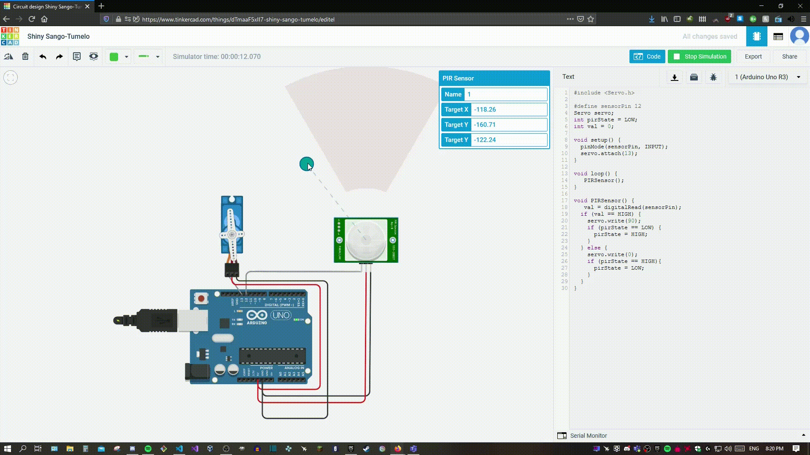

# Automatic Disinfectant Dispenser 2000©

## Съдържание
    1. Цел
    2. Материали
    3. Кодът
## Цел
В свят покосен от пандемия е необходимо да спазваме всички мерки против развитието на вируса. Контактът с всякакви повърхности следва да бъде ограничен. Моят проект цели точно това - безконтактно ползване на дезинфектант.
## Материали
    1. Arduino Uno x1
    2. Servomotor x1
    3. PIR Sensor x1
### Arduino Uno – микроконтролерна развойна платка с ATmega328P AVR микроконтролер. Има 14 цифрови входно-изходни (I/O) порта, 6 аналогови входа, 16 MHz кварцов резонатор, четири светодиода (един потребителски, свързан на 13-и цифров I/O порт и три, които индикират работата на платката: ON, Tx и Rx), USB конектор, захранващ куплунг, бутон за рестартиране и ICSP конектор. Шест от цифровите I/O порта могат да се използват като PWM (ШИМ) изходи. Свързването с компютър се осъществява чрез USB кабел USB A – USB B. Uno може да се захранва през USB порта на компютъра или от външен източник, като превключването между различните начини за захранване е автоматично. Външният източник на захранване може да е DC адаптер 7-12V или батерия.


### Servomotor - вид електродвигател, предназначен за привеждане в движение на устройства за управление. Предоставя прецизен контрол по линейни и ъглови позиции, скорости и ускорение. Обикновено сервомоторите са с малки габарити и мощност. Важни характеристики на сервомотора са също масата, динамиката на двигателя, равномерността на движение и ефективността. 


 ### PIR sensor - инфрачервени датчици, които са доста по-сложни от останалите видове датчици. Наричат се още датчик за движение или сензор за движение. PIR датчиците имат два слота, като всеки от тях е направен от специален материал, чувствителен към инфрачервени лъчи. Самият сензор е херметически затворен в метална кутия, което подобрява издръжливостта му към температурните промени, влажността и шума.


## Кодът
    1. Arduino IDE
    2. Servo.h

### 1. За реализиране на програмата на проекта използвах Arduino IDE. Mеждуплатформено приложение, което е написано с функции от C и C++. Използва се за писане и качване на програми на платки, съвместими с Arduino, но също така и други платки с вградена система. 

### 2. Servo.h е библиотека позволяваща на Arduino да контролира множество от серво мотори.

```
#include <Servo.h>

#define sensorPin 12
Servo servo;
int pirState = LOW;
int val = 0;

void setup() {
  pinMode(sensorPin, INPUT); 
  servo.attach(13);
}

void loop() {
   PIRSensor();
}

void PIRSensor() {
   val = digitalRead(sensorPin);
  if (val == HIGH) {
    servo.write(0);
    if (pirState == LOW) {
      pirState = HIGH;
    }
  } else {
    servo.write(90); 
    if (pirState == HIGH){
      pirState = LOW;
    }
  }
}
```